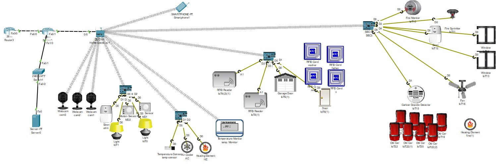

# 🏠 Projet : Conception d’une maison intelligente et sécurisée

## 🎯 Objectifs

- Créer un réseau **IoT sécurisé** pour une maison intelligente dans Cisco Packet Tracer.
- Configurer et programmer des **objets IoT** (capteurs, actionneurs, caméras, serrures intelligentes).
- **Automatiser** les équipements pour optimiser l’énergie et le confort.
- Assurer la **cybersécurité** du réseau avec chiffrement, authentification, pare-feu et IDS/IPS.

---

## 🛠️ Technologies et outils utilisés

- **Cisco Packet Tracer** : simulation des objets connectés et réseau local.
- **GNS3** : simulation avancée avec dispositifs de sécurité (pare-feu, IDS/IPS).
- **Objets IoT** : capteurs de température, détecteurs de mouvement, interrupteurs connectés, caméras IP, serrures intelligentes.
- **Protocoles de communication** : MQTT, HTTPS, Wi-Fi.
- **Langages** : JavaScript, Python.

---

## 🔐 Sécurité IoT

- **Chiffrement TLS/SSL** pour protéger les données échangées.
- **Authentification forte** pour éviter les intrusions.
- **Pare-feu** et **IDS/IPS** (via GNS3) pour détecter et contrer les cyberattaques.
- **Scripts personnalisés** pour automatisation et surveillance.

---

## 🧠 Architecture du système

  

---

